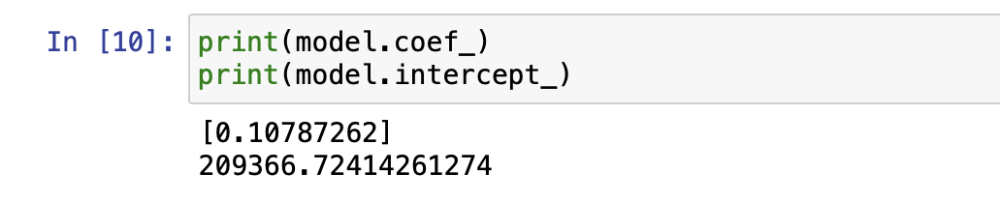
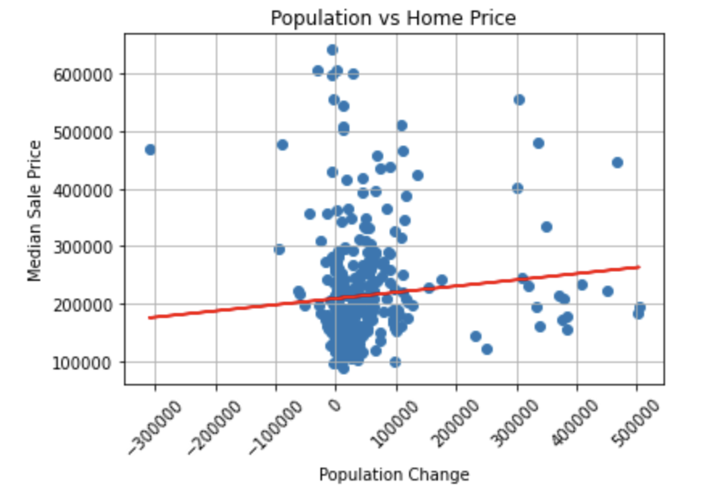

# Group_Project_Real_Estate
Group Project for UCSD Data Science Bootcamp
## Predictions with a Linear Regression Model
The purpose of this project was to study trends in change of median home prices in the United States. After finding a correlation between home prices and interstate migration within the US we created a linear regression model using supervised machine learning. We used this model to examine how much migration affects home prices and to make prediction of future prices.

We first cleaned our data on pandas then exported our dataframes to SQL where we applied an inner join on year and state to merge our dataframes and exported them back to pandas. We then fit our new data into a Lindear Regression model which provided us with a model coefficient of 0.11 and a 209366 model intercept. 

A model coefficient of 0.11 shows that migration does have a positive correlation on home prices, but such a small coefficient provides us with insight that there is somthing else influencing rising home prices much more than migration.

## Results
After plotting our data and examining our results we can predict that continued growth in population in any given state will increase the price of homes a small amount.