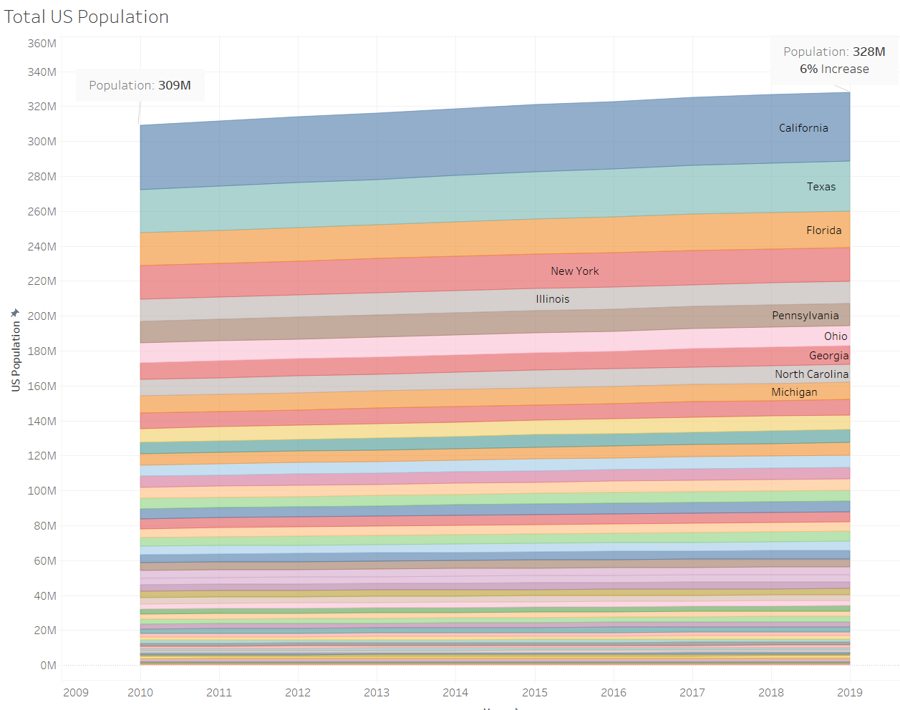
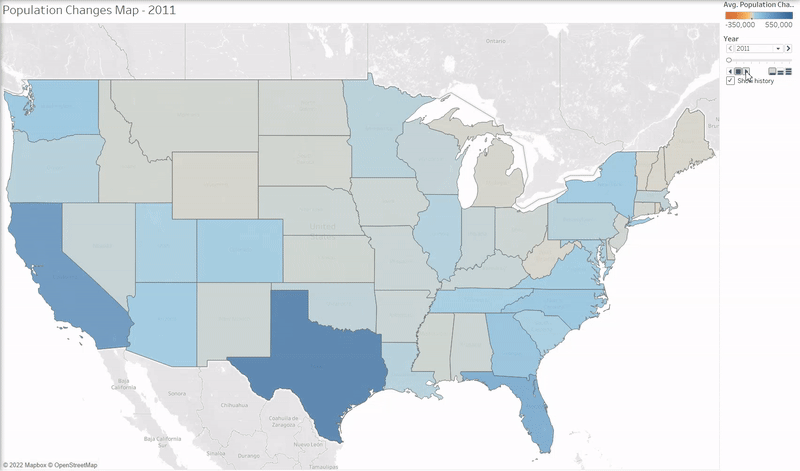
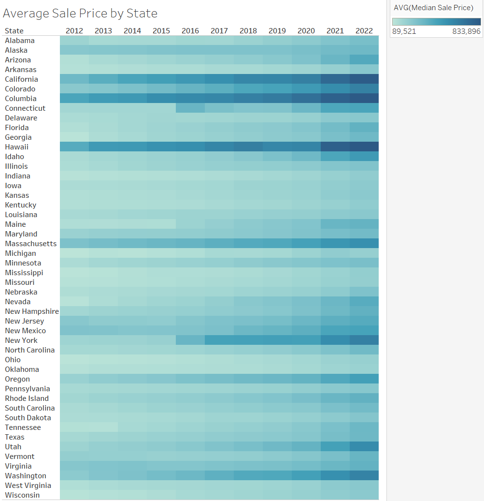
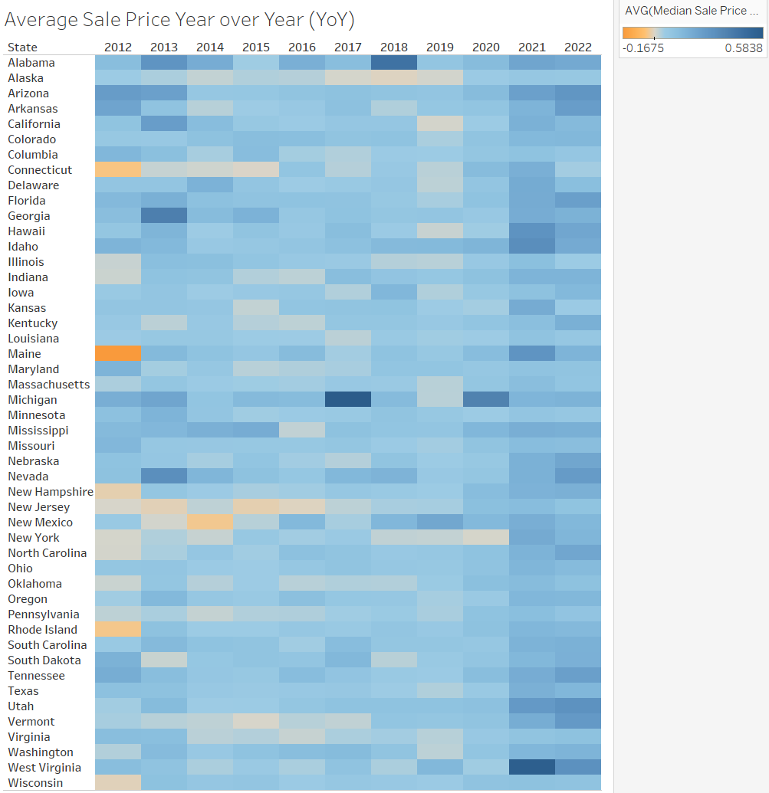
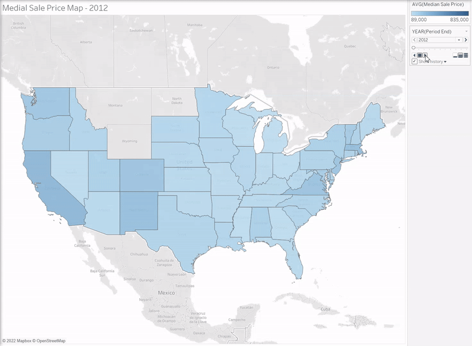
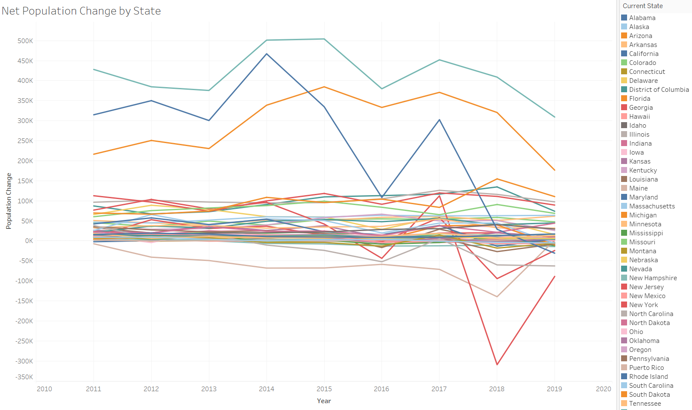
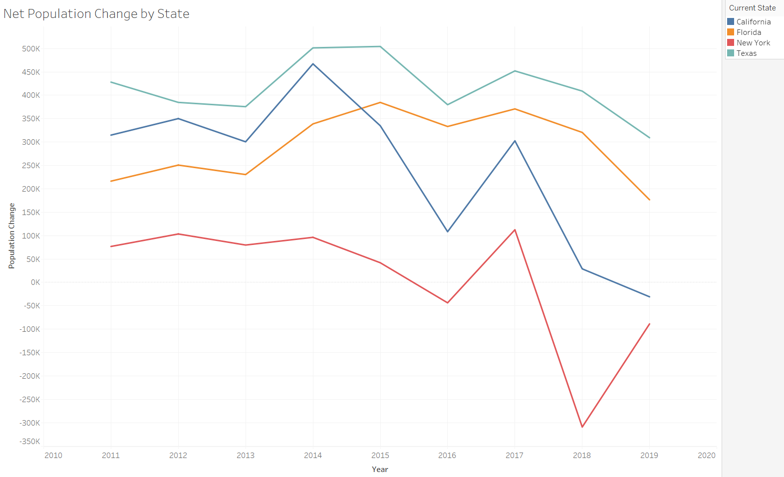
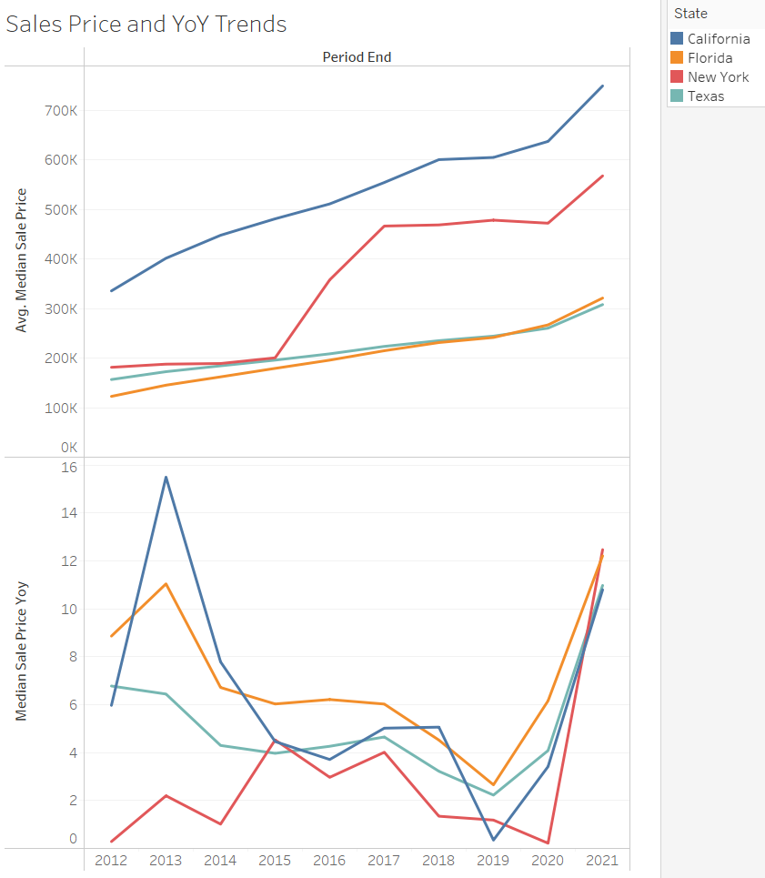
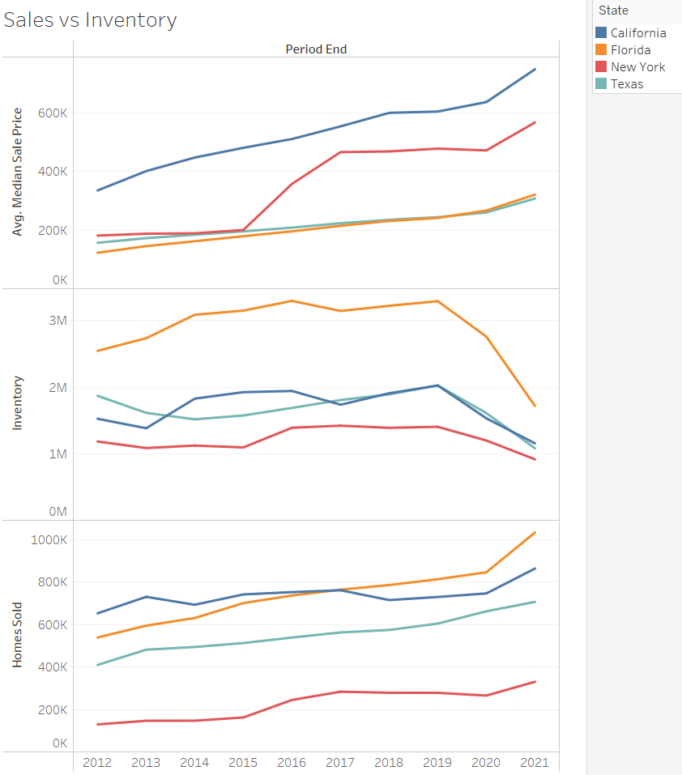
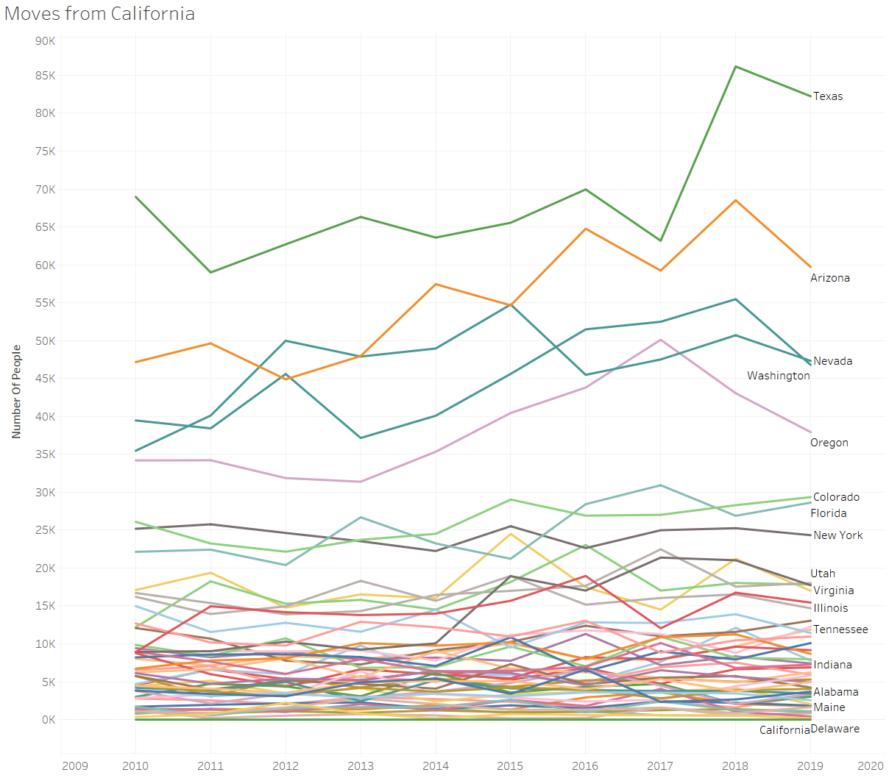

## Hypothesis
Population and migration trends would have a high correlation to housing prices.  Based on these migration trends, one would be able to predict price changes.

## US Population Trends (2010-2019 Data)
- US Population Growth by State

US population grew 6% from 2010 to 2019.  Most states staying relatively flat, but a few states contributing more than others to these numbers.

- Net population per state over time

Map of the US showing population growth/decline from 2010 to 2019.  Makes it easy to identify if states have a net growth or decline over time.  Coastal, Wester, and Southern states showing the largest increase over time.

## US Real Estate Pricing Trends (2012-2022 Data)
- Average Median Sales Price Heatmap
  
Almost all states got more expensive as time progressed, but population gains aren't signifigant in most of the states that gained.

- Average Median Sales Price Year over Year (YoY) (% Gain/Decline)
  
All states generally increasing at a faster pace through the later years

- US Median Sales Price over Time 
  
Almost all states getting more expensive as time progresses - midwest and a select few dont increase as much.  Coastal states as well as Colorado and Texas grow the most.

## Closer Look at Outlier States
- Population Data over time by state 
  
California, Florida, New York, and Texas were noteable outliers.

- Downselected states
  
Outlier states with large population increases over time are California, Florida, and Texas.  New York suprisingly had a large decline in population in 2018.

- Sales Price and YoY trends for downselected states
  
As population growth slowed down or declined in California and New York, there is a flattening of price growth.  However, Florida and Texas house prices continue to grow at relatively the same rate, even though population growth was declining.  This validates there not being a strong correlation between population and home price.  Vertical Line represents where population data cuts off. 

- Sales, Inventory, and homes sold for downselected states
  
Similar to the Price and YoY trends, not a strong correlation between population changes and Inventory / Homes Sold.  Trends remain unchanged even though population growth is changing.

 

Conclusions:
- Based on analyzing the datasets, we see that during this time scale, net population change does not have a strong correlation with housing prices.
- Initially we were looking at state to state migrations, but we realized we were missing the net population growth/decline of each state per year.  We knew that 100k people moved into a state and from where, but we did not know how many people moved out so the initial analysis was misleading.  This led us to calculate the "Net Population Change" for each state per year.
    - Moves from California to show interesting data, however without the net population change, this data wasnt very helpful to determine real estate prices at a State level.
     

Limitations:
- Data sets didnt fully overlap on timescale.  The main driver for this hypothesis was trying to determine correlation between population growth and housing prices in states where a lot of people moved during the COVID-19 pandemic.
- Had to create "net population change" so "lost" 2010 data as this was used as the baseline to measure from.

- pick out hawaii as not much population growth but a crazy amount of price increase??

Future Items:
- Ratio of "Net Population Change" vs Average Median Home Price per state per year.  This could distill all these graphs into one metric and show any potential correlation/outliers
- Find additional datasets to cover population/migration during COVID-19
    - States like Idaho had extreme YoY prices increases during the pandemic, and it seems as though this could have been caused by the migration of people to states like this
- Bring in additional metrics such as job growth to determine additional correlation to housing prices in a region.